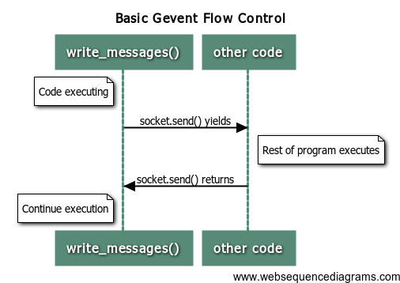
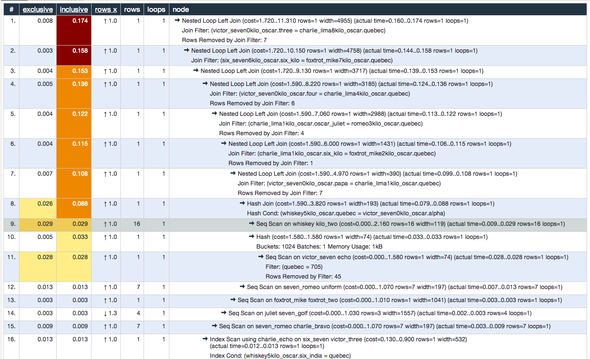

# Wicked Production SQLAlchemy

---


---


---
# Lying
---

```sql
SELECT  titel, 2011-Jahr AS alt, 'Jahre alt' AS Text
FROM    buch
WHERE   jahr > 1997
ORDER BY alt DESC, titel

SELECT  B.buchid, B.titel, V.name, V.ort, B.jahr
FROM    buch B NATURAL JOIN verlag V
WHERE   V.name='Springer' AND B.jahr>=1990
ORDER   BY V.ort

SELECT  DISTINCT A.nachname, A.vornamen, A.autorid
FROM    autor A NATURAL JOIN buch_aut BA
        NATURAL JOIN buch_sw BS NATURAL JOIN schlagwort SW
WHERE   SW.schlagwort = 'Datenbank'
ORDER BY A.nachname

SELECT buchid, titel, jahr
FROM buch
WHERE jahr=(SELECT MIN(jahr) FROM buch)
```
---


---

# “Parallel” Queries...
### sort of...
### not really...
# it's lying

---
# gevent

* Fast event loop
* Lightweight execution units
* Monkey patching utility

---



---
# Coloring PostgreSQL Green
```python
def gevent_wait_callback(conn, timeout=None):
    """A wait callback useful to allow gevent to work with Psycopg."""
    while True:
        state = conn.poll()
        if state == extensions.POLL_OK:
            break
        elif state == extensions.POLL_READ:
            wait_read(conn.fileno(), timeout=timeout)
        elif state == extensions.POLL_WRITE:
            wait_write(conn.fileno(), timeout=timeout)
        else:
            raise psycopg2.OperationalError(
                "Bad result from poll: %r" % state)
```
---
# Coloring PostgreSQL Green
```python
def make_psycopg_green():
    """Configure Psycopg to be used with gevent in non-blocking way."""
    if not hasattr(extensions, 'set_wait_callback'):
        raise ImportError(
            "support for coroutines not available in this Psycopg version (%s)"
            % psycopg2.__version__)

    extensions.set_wait_callback(gevent_wait_callback)
```
---
# Building a Query Pool (__init__)
```python
import gevent
from gevent.queue import JoinableQueue, Queue
class QueryPool(object):
    def __init__(self, queries, pool_size=5):
        self.queries = queries
        self.POOL_MAX = pool_size
        self.tasks = JoinableQueue()
        self.output_queue = Queue()
```

---
# Building a Query Pool (work)
```python
def __query(self, query):
    conn = engine.connect()
    results = conn.execute(query).fetchall()
    return results
```
---

# Building a Query Pool (Executor)
```python
def executor(self, number):
    while not self.tasks.empty():
        query = self.tasks.get()
        try:
            results = self.__query(query)
            self.output_queue.put(results)
        except Exception as exc_info:
            print exc_info
            print 'Query failed :('
        self.tasks.task_done()
```
---
# Building a Query Pool (Overseer)
```python
def overseer(self):
    for query in self.queries:
        self.tasks.put(query)
```
---
# Building a Query Pool (runner)
```python
def run(self):
    self.running = []
    gevent.spawn(self.overseer).join()
    for i in range(self.POOL_MAX):
        runner = gevent.spawn(self.executor, i)
        runner.start()
        self.running.append(runner)

    self.tasks.join()
    for runner in self.running:
        runner.kill()
    return [x for x in self.output_queue]
```

---
# Queries

```python
query1 = select([pgbench_tellers])
query2 = select([pgbench_accounts.c.bid, func.count(1)]).group_by(pgbench_accounts.c.bid)
query3 = select([pgbench_branches])
query4 = select([pgbench_accounts.c.bid]).distinct()
query5 = select([pgbench_accounts]).limit(1000)
query6 = select([pgbench_accounts.c.bid, func.count(1)]
               ).group_by(pgbench_accounts.c.bid).limit(5000)

queries = [query1, query2, query3, query4, query5, query6]
```
---
# Putting it all together

```python
make_psycopg_green()
results = QueryPool(queries).run()
```

---

# Well... is it worth it...
### Executing the 6 queries

* 57s: Serially
* 49.7s: Query pool 2 workers
* 31.4s: Query pool 3 workers
* 30s: Query pool 5 workers
* 27.5s: Query pool with 6 workers

---



---


---
# Dogpile (regions)
```python
regions = {}

regions['default'] = make_region(async_creation_runner=async_creation_runner,
                                 key_mangler=mangle_key).configure(
    'dogpile.cache.redis',
    arguments={
        'host': redis_host,
        'port': redis_port,
        'db': settings.CACHES['default']['OPTIONS']['DB'],
        'redis_expiration_time': 60*60*2,   # 2 hours
        'distributed_lock': True,
        'lock_timeout': 120,
        'lock_sleep': 5
    }
)
```
---
# Dogpile (Dealing with Locking)
```python
def async_creation_runner(cache, somekey, creator, mutex):
    def runner():
        try:
            value = creator()
            cache.set(somekey, value)
        finally:
            mutex.release()

    thread = threading.Thread(target=runner)
    thread.start()
```
---
# Dogpile (Cache Keys)

```python
def unicode_sha1_mangle_key(key):
    return sha1_mangle_key(clean_unicode(key))


def mangle_key(key):
    prefix, key = key.split(':', 1)
    base = 'cookie:cache:'
    if prefix:
        base += '{}'.format(prefix)
    else:
        raise ValueError(key)
    return '{}:{}'.format(base, unicode_sha1_mangle_key(key))
```
---

# CachingQuery (__init__, __iter__)

```python
class CachingQuery(Query):

    def __init__(self, regions, *args, **kw):
        self.cache_regions = regions
        self.saved_to_cache = False
        Query.__init__(self, *args, **kw)

    def __iter__(self):
        if hasattr(self, '_cache_region'):
            return self.get_value(
                createfunc=lambda: list(Query.__iter__(self)))
        else:
            return Query.__iter__(self)
```
---
# CachingQuery (regions)

```python
    def _get_cache_plus_key(self):
        dogpile_region = self.cache_regions[self._cache_region.region]
        if self._cache_region.cache_key:
            key = self._cache_region.cache_key
        else:
            key = _key_from_query(self)
        return dogpile_region, key
```
---
# CachingQuery (Getter)

```python
    def get_value(self, merge=True, createfunc=None,
                  expiration_time=None, ignore_expiration=False):
        dogpile_region, cache_key = self._get_cache_plus_key()

        assert not ignore_expiration or not createfunc, \
            "Can't ignore expiration and also provide createfunc"

        if ignore_expiration or not createfunc:
            cached_value = dogpile_region.get(
                cache_key,
                expiration_time=expiration_time,
                ignore_expiration=ignore_expiration
            )
```
---
# CachingQuery (Getter - cont)

```python
        else:
            try:
                cached_value = dogpile_region.get_or_create(
                    cache_key,
                    createfunc,
                    expiration_time=expiration_time
                )
            except ConnectionError:
                logger.error('Cannot connect to query caching backend!')
                cached_value = createfunc()
        if cached_value is NO_VALUE:
            raise KeyError(cache_key)
        if merge:
            cached_value = self.merge_result(cached_value, load=False)
        return cached_value
```
---
# CachingQuery (Setter)

```python
    def set_value(self, value):
        dogpile_region, cache_key = self._get_cache_plus_key()
        try:
            dogpile_region.set(cache_key, value)
            self.saved_to_cache = True
        except ConnectionError:
            logger.error('Cannot connect to query caching backend!')

```
---
# CachingQuery (Key Generator)

```python
def _key_from_query(query, qualifier=None):
    stmt = query.with_labels().statement
    compiled = stmt.compile()
    params = compiled.params

    return " ".join([clean_unicode(compiled)] +
                    [clean_unicode(params[k]) for k in sorted(params)])
```
---
# SQLAlchemy Options (FromQuery)
```python
class FromCache(MapperOption):
    """Specifies that a Query should load results from a cache."""

    propagate_to_loaders = False

    def __init__(self, region="default", cache_key=None, cache_prefix=None):
        self.region = region
        self.cache_key = cache_key
        self.cache_prefix = cache_prefix

    def process_query(self, query):
        query._cache_region = self
```
---
# Callable
```python
def query_callable(regions, query_cls=CachingQuery):
    def query(*arg, **kw):
        return query_cls(regions, *arg, **kw)
    return query
```
---
# Putting it together (Session)

```python
def init_caching_session(engine=None):
    if not engine:
        return

    return sessionmaker(
        bind=engine, autoflush=False, autocommit=False,
        query_cls=query_callable(regions)
    )

CachingSession = init_caching_session(engine)
caching_session=CachingSession()
```
---
# Putting it together (Query)

```python
query = caching_session.query(Accounts.bid, func.count(1)
   ).group_by(Accounts.bid).limit(5000).options(
       FromCache('default'))
```
---
# Well... is it worth it...
### Executing the query

* 24.9s: Uncached

* 24.9s: Initial run of caching_query
* 4.32 ms: Second run of caching_query
